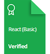
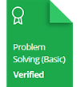
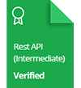

    

# HackerRank | Practice, Tutorials & Interview Preparation Solutions

This repository consists of solutions to HackerRank **practice**, **tutorials**, and **interview preparation** problems with **Python**, **mySQL**, **C#**, and **JavaScript**.

## Personal HackerRank Profile

[View Profile](https://www.hackerrank.com/nathanabela7)

## HackerRank Badges

## HackerRank Certificates

## Table Of Contents

* [Practices Completed](#practices-completed)
* [Tutorials Completed](#tutorials-completed)
* [Interview Preparation Kit](#interview-preparation-kit)
* [Certificates](#certificates)

## Practices Completed

* [Python](#python)
* [Regex](#regex)
* [Security](#security)
* [SQL](#sql)

### Python

|       Subdomain       |                 Challenge                 |                                             Problem                                              | Difficulty | Score |                                             Solution                                              |
| :-------------------: | :---------------------------------------: | :----------------------------------------------------------------------------------------------: | :--------: | :---: | :-----------------------------------------------------------------------------------------------: |
|     Introduction      |      Say 'Hello, World!' With Python      |             [Problem](https://www.hackerrank.com/challenges/py-hello-world/problem)              |    Easy    |   5   |   [Solution](/Python/01%20-%20Introduction/01%20-%20Say%20'Hello,%20World!'%20With%20Python.py)   |
|     Introduction      |              Python If-Else               |               [Problem](https://www.hackerrank.com/challenges/py-if-else/problem)                |    Easy    |  10   |              [Solution](/Python/01%20-%20Introduction/02%20-%20Python%20If-Else.py)               |
|     Introduction      |           Arithmetic Operators            |       [Problem](https://www.hackerrank.com/challenges/python-arithmetic-operators/problem)       |    Easy    |  10   |           [Solution](/Python/01%20-%20Introduction/03%20-%20Arithmetic%20Operators.py)            |
|     Introduction      |              Python Division              |             [Problem](https://www.hackerrank.com/challenges/python-division/problem)             |    Easy    |  10   |            [Solution](/Python/01%20-%20Introduction/04%20-%20Python%20-%20Division.py)            |
|     Introduction      |                   Loops                   |              [Problem](https://www.hackerrank.com/challenges/python-loops/problem)               |    Easy    |  10   |                    [Solution](/Python/01%20-%20Introduction/05%20-%20Loops.py)                    |
|     Introduction      |             Write a function              |            [Problem](https://www.hackerrank.com/challenges/write-a-function/problem)             |   Medium   |  10   |            [Solution](/Python/01%20-%20Introduction/06%20-%20Write%20a%20function.py)             |
|     Introduction      |              Print Function               |              [Problem](https://www.hackerrank.com/challenges/python-print/problem)               |    Easy    |  20   |              [Solution](/Python/01%20-%20Introduction/07%20-%20Print%20Function.py)               |
|   Basic Data Types    |            List Comprehensions            |           [Problem](https://www.hackerrank.com/challenges/list-comprehensions/problem)           |    Easy    |  10   |        [Solution](/Python/02%20-%20Basic%20Data%20Types/01%20-%20List%20Comprehensions.py)        |
|   Basic Data Types    |         Find the Runner-Up Score!         |  [Problem](https://www.hackerrank.com/challenges/find-second-maximum-number-in-a-list/problem)   |    Easy    |  10   |   [Solution](/Python/02%20-%20Basic%20Data%20Types/02%20-%20Find%20the%20Runner-up%20Score!.py)   |
|   Basic Data Types    |               Nested Lists                |               [Problem](https://www.hackerrank.com/challenges/nested-list/problem)               |    Easy    |  10   |           [Solution](/Python/02%20-%20Basic%20Data%20Types/03%20-%20Nested%20Lists.py)            |
|   Basic Data Types    |          Finding the percentage           |         [Problem](https://www.hackerrank.com/challenges/finding-the-percentage/problem)          |    Easy    |  10   |     [Solution](/Python/02%20-%20Basic%20Data%20Types/04%20-%20Finding%20the%20percentage.py)      |
|   Basic Data Types    |                   Lists                   |              [Problem](https://www.hackerrank.com/challenges/python-lists/problem)               |    Easy    |  10   |                [Solution](/Python/02%20-%20Basic%20Data%20Types/05%20-%20Lists.py)                |
|   Basic Data Types    |                  Tuples                   |              [Problem](https://www.hackerrank.com/challenges/python-tuples/problem)              |    Easy    |  10   |               [Solution](/Python/02%20-%20Basic%20Data%20Types/06%20-%20Tuples.py)                |
|        Strings        |                 sWAP cASE                 |                [Problem](https://www.hackerrank.com/challenges/swap-case/problem)                |    Easy    |  10   |                   [Solution](/Python/03%20-%20Strings/01%20-%20sWAP%20cASE.py)                    |
|        Strings        |           String Split and Join           |      [Problem](https://www.hackerrank.com/challenges/python-string-split-and-join/problem)       |    Easy    |  10   |           [Solution](/Python/03%20-%20Strings/02%20-%20String%20Split%20and%20Join.py)            |
|        Strings        |             What's Your Name?             |             [Problem](https://www.hackerrank.com/challenges/whats-your-name/problem)             |    Easy    |  10   |               [Solution](/Python/03%20-%20Strings/03%20-%20What's%20Your%20Name.py)               |
|        Strings        |                 Mutations                 |            [Problem](https://www.hackerrank.com/challenges/python-mutations/problem)             |    Easy    |  10   |                    [Solution](/Python/03%20-%20Strings/04%20-%20Mutations.py)                     |
|        Strings        |               Find a string               |              [Problem](https://www.hackerrank.com/challenges/find-a-string/problem)              |    Easy    |  10   |                [Solution](/Python/03%20-%20Strings/05%20-%20Find%20a%20string.py)                 |
|        Strings        |             String Validators             |            [Problem](https://www.hackerrank.com/challenges/string-validators/problem)            |    Easy    |  10   |               [Solution](/Python/03%20-%20Strings/06%20-%20String%20Validators.py)                |
|        Strings        |              Text Alignment               |             [Problem](https://www.hackerrank.com/challenges/text-alignment/problem)              |    Easy    |  10   |                 [Solution](/Python/03%20-%20Strings/07%20-%20Text%20Alignment.py)                 |
|        Strings        |                 Text Wrap                 |                [Problem](https://www.hackerrank.com/challenges/text-wrap/problem)                |    Easy    |  10   |                   [Solution](/Python/03%20-%20Strings/08%20-%20Text%20Wrap.py)                    |
|        Strings        |             Designer Door Mat             |            [Problem](https://www.hackerrank.com/challenges/designer-door-mat/problem)            |    Easy    |  10   |              [Solution](/Python/03%20-%20Strings/09%20-%20Designer%20Door%20Mat.py)               |
|        Strings        |             String Formatting             |        [Problem](https://www.hackerrank.com/challenges/python-string-formatting/problem)         |    Easy    |  10   |               [Solution](/Python/03%20-%20Strings/10%20-%20String%20Formatting.py)                |
|        Strings        |             Alphabet Rangoli              |            [Problem](https://www.hackerrank.com/challenges/alphabet-rangoli/problem)             |    Easy    |  20   |                [Solution](/Python/03%20-%20Strings/11%20-%20Alphabet%20Rangoli.py)                |
|        Strings        |                Capitalize!                |               [Problem](https://www.hackerrank.com/challenges/capitalize/problem)                |    Easy    |  20   |                   [Solution](/Python/03%20-%20Strings/12%20-%20Capitalize!.py)                    |
|        Strings        |              The Minion Game              |             [Problem](https://www.hackerrank.com/challenges/the-minion-game/problem)             |   Medium   |  40   |               [Solution](/Python/03%20-%20Strings/13%20-%20The%20Minion%20Game.py)                |
|        Strings        |             Merge the Tools!              |             [Problem](https://www.hackerrank.com/challenges/merge-the-tools/problem)             |   Medium   |  40   |               [Solution](/Python/03%20-%20Strings/14%20-%20Merge%20The%20Tools!.py)               |
|         Sets          |           Introduction to Sets            |         [Problem](https://www.hackerrank.com/challenges/py-introduction-to-sets/problem)         |    Easy    |  10   |              [Solution](/Python/04%20-%20Sets/01%20-%20Introduction%20to%20Sets.py)               |
|         Sets          |                 No Idea!                  |                 [Problem](https://www.hackerrank.com/challenges/no-idea/problem)                 |   Medium   |  50   |                     [Solution](/Python/04%20-%20Sets/02%20-%20No%20Idea!.py)                      |
|         Sets          |           Symmetric Difference            |          [Problem](https://www.hackerrank.com/challenges/symmetric-difference/problem)           |    Easy    |  10   |               [Solution](/Python/04%20-%20Sets/03%20-%20Symmetric%20Difference.py)                |
|         Sets          |                 Set add()                 |               [Problem](https://www.hackerrank.com/challenges/py-set-add/problem)                |    Easy    |  10   |                     [Solution](/Python/04%20-%20Sets/04%20-%20Set%20add().py)                     |
|         Sets          |       Set discard() remove() pop()        |        [Problem](https://www.hackerrank.com/challenges/py-set-discard-remove-pop/problem)        |    Easy    |  10   |       [Solution](/Python/04%20-%20Sets/05%20-%20Set%20discard(),%20remove()%20&%20pop().py)       |
|         Sets          |           Set union() Operation           |              [Problem](https://www.hackerrank.com/challenges/py-set-union/problem)               |    Easy    |  10   |              [Solution](/Python/04%20-%20Sets/06%20-%20Set%20union()%20Operation.py)              |
|         Sets          |       Set intersection() Operation        |      [Problem](https://www.hackerrank.com/challenges/py-set-intersection-operation/problem)      |    Easy    |  10   |          [Solution](/Python/04%20-%20Sets/07%20-%20Set%20intersection()%20Operation.py)           |
|         Sets          |        Set difference() Operation         |       [Problem](https://www.hackerrank.com/challenges/py-set-difference-operation/problem)       |    Easy    |  10   |           [Solution](/Python/04%20-%20Sets/08%20-%20Set%20difference()%20Operation.py)            |
|         Sets          |   Set symmetric_difference() Operation    |  [Problem](https://www.hackerrank.com/challenges/py-set-symmetric-difference-operation/problem)  |    Easy    |  10   |      [Solution](/Python/04%20-%20Sets/09%20-%20Set%20symmetric_difference()%20Operation.py)       |
|         Sets          |               Set Mutations               |            [Problem](https://www.hackerrank.com/challenges/py-set-mutations/problem)             |    Easy    |  10   |                   [Solution](/Python/04%20-%20Sets/10%20-%20Set%20Mutations.py)                   |
|         Sets          |            The Captain's Room             |          [Problem](https://www.hackerrank.com/challenges/py-the-captains-room/problem)           |    Easy    |  10   |               [Solution](/Python/04%20-%20Sets/11%20-%20The%20Captain's%20Room.py)                |
|         Sets          |               Check Subset                |             [Problem](https://www.hackerrank.com/challenges/py-check-subset/problem)             |    Easy    |  10   |                   [Solution](/Python/04%20-%20Sets/12%20-%20Check%20Subset.py)                    |
|         Sets          |           Check Strict Superset           |        [Problem](https://www.hackerrank.com/challenges/py-check-strict-superset/problem)         |    Easy    |  10   |              [Solution](/Python/04%20-%20Sets/13%20-%20Check%20Strict%20Superset.py)              |
|         Math          |             Polar Coordinates             |            [Problem](https://www.hackerrank.com/challenges/polar-coordinates/problem)            |    Easy    |  10   |                 [Solution](/Python/05%20-%20Math/01%20-%20Polar%20Coordinates.py)                 |
|         Math          |              Find Angle MBC               |               [Problem](https://www.hackerrank.com/challenges/find-angle/problem)                |   Medium   |  10   |                 [Solution](/Python/05%20-%20Math/02%20-%20Find%20Angle%20MBC.py)                  |
|         Math          |             Triangle Quest 2              |            [Problem](https://www.hackerrank.com/challenges/triangle-quest-2/problem)             |   Medium   |  20   |                [Solution](/Python/05%20-%20Math/03%20-%20Triangle%20Quest%202.py)                 |
|         Math          |                Mod Divmod                 |            [Problem](https://www.hackerrank.com/challenges/python-mod-divmod/problem)            |    Easy    |  10   |                    [Solution](/Python/05%20-%20Math/04%20-%20Mod%20Divmod.py)                     |
|         Math          |             Power - Mod Power             |         [Problem](https://www.hackerrank.com/challenges/python-power-mod-power/problem)          |    Easy    |  10   |               [Solution](/Python/05%20-%20Math/05%20-%20Power%20-%20Mod%20Power.py)               |
|         Math          |        Integers Come In All Sizes         |    [Problem](https://www.hackerrank.com/challenges/python-integers-come-in-all-sizes/problem)    |    Easy    |  10   |         [Solution](/Python/05%20-%20Math/06%20-%20Integers%20Come%20In%20All%20Sizes.py)          |
|         Math          |              Triangle Quest               |             [Problem](https://www.hackerrank.com/challenges/python-quest-1/problem)              |   Medium   |  20   |                  [Solution](/Python/05%20-%20Math/07%20-%20Triangle%20Quest.py)                   |
|       Itertools       |            itertools.product()            |            [Problem](https://www.hackerrank.com/challenges/itertools-product/problem)            |    Easy    |  10   |              [Solution](/Python/06%20-%20Itertools/01%20-%20itertools.product().py)               |
|       Itertools       |         itertools.permutations()          |         [Problem](https://www.hackerrank.com/challenges/itertools-permutations/problem)          |    Easy    |  10   |            [Solution](/Python/06%20-%20Itertools/02%20-%20itertools.permutations().py)            |
|       Itertools       |         itertools.combinations()          |         [Problem](https://www.hackerrank.com/challenges/itertools-combinations/problem)          |    Easy    |  10   |            [Solution](/Python/06%20-%20Itertools/03%20-%20itertools.combinations().py)            |
|       Itertools       | itertools.combinations_with_replacement() | [Problem](https://www.hackerrank.com/challenges/itertools-combinations-with-replacement/problem) |    Easy    |  10   |   [Solution](/Python/06%20-%20Itertools/04%20-%20itertools.combinations_with_replacement().py)    |
|       Itertools       |           Compress the String!            |           [Problem](https://www.hackerrank.com/challenges/compress-the-string/problem)           |   Medium   |  20   |            [Solution](/Python/06%20-%20Itertools/05%20-%20Compress%20the%20String!.py)            |
|       Itertools       |          Iterables and Iterators          |         [Problem](https://www.hackerrank.com/challenges/iterables-and-iterators/problem)         |   Medium   |  40   |          [Solution](/Python/06%20-%20Itertools/06%20-%20Iterables%20and%20Iterators.py)           |
|       Itertools       |               Maximize It!                |               [Problem](https://www.hackerrank.com/challenges/maximize-it/problem)               |    Hard    |  50   |                 [Solution](/Python/06%20-%20Itertools/07%20-%20Maximize%20It!.py)                 |
|      Collections      |           collections.Counter()           |           [Problem](https://www.hackerrank.com/challenges/collections-counter/problem)           |    Easy    |  10   |            [Solution](/Python/07%20-%20Collections/01%20-%20collections.Counter().py)             |
|      Collections      |           defaultdict Tutorial            |          [Problem](https://www.hackerrank.com/challenges/defaultdict-tutorial/problem)           |    Easy    |  20   |  [Solution](/30%20Days%20of%20Code/26%20-%20Day%2025%20-%20Running%20Time%20and%20Complexity.py)  |
|      Collections      |         collections.namedtuple()          |        [Problem](https://www.hackerrank.com/challenges/py-collections-namedtuple/problem)        |    Easy    |  20   |           [Solution](/Python/07%20-%20Collections/03%20-%20collections.namedtuple().py)           |
|      Collections      |         collections.OrderedDict()         |       [Problem](https://www.hackerrank.com/challenges/py-collections-ordereddict/problem)        |    Easy    |  20   |          [Solution](/Python/07%20-%20Collections/04%20-%20collections.OrderedDict().py)           |
|      Collections      |            collections.deque()            |          [Problem](https://www.hackerrank.com/challenges/py-collections-deque/problem)           |    Easy    |  20   |             [Solution](/Python/07%20-%20Collections/05%20-%20collections.deque().py)              |
|      Collections      |               Company Logo                |              [Problem](https://www.hackerrank.com/challenges/most-commons/problem)               |   Medium   |  40   |                [Solution](/Python/07%20-%20Collections/06%20-%20Company%20Logo.py)                |
|      Collections      |                Word Order                 |               [Problem](https://www.hackerrank.com/challenges/word-order/problem)                |   Medium   |  50   |                 [Solution](/Python/07%20-%20Collections/07%20-%20Word%20Order.py)                 |
|      Collections      |                Piling Up!                 |                [Problem](https://www.hackerrank.com/challenges/piling-up/problem)                |   Medium   |  50   |                 [Solution](/Python/07%20-%20Collections/08%20-%20Piling%20Up!.py)                 |
|     Date and Time     |              Calendar Module              |             [Problem](https://www.hackerrank.com/challenges/calendar-module/problem)             |    Easy    |  10   |           [Solution](/Python/08%20-%20Date%20and%20Time/01%20-%20Calendar%20Module.py)            |
|     Date and Time     |                Time Delta                 |            [Problem](https://www.hackerrank.com/challenges/python-time-delta/problem)            |   Medium   |  30   |              [Solution](/Python/08%20-%20Date%20and%20Time/02%20-%20Time%20Delta.py)              |
| Errors and Exceptions |                Exceptions                 |               [Problem](https://www.hackerrank.com/challenges/exceptions/problem)                |    Easy    |  10   |           [Solution](/Python/09%20-%20Errors%20and%20Exceptions/01%20-%20Exceptions.py)           |
| Errors and Exceptions |              Incorrect Regex              |             [Problem](https://www.hackerrank.com/challenges/incorrect-regex/problem)             |    Easy    |  20   |       [Solution](/Python/09%20-%20Errors%20and%20Exceptions/02%20-%20Incorrect%20Regex.py)        |
|        Classes        |  Classes - Dealing with Complex Numbers   |  [Problem](https://www.hackerrank.com/challenges/class-1-dealing-with-complex-numbers/problem)   |   Medium   |  20   | [Solution](/Python/10%20-%20Classes/01%20-%20Classes%20-%20Dealing%20with%20Complex%20Numbers.py) |
|        Classes        |    Class 2 - Find the Torsional Angle     |    [Problem](https://www.hackerrank.com/challenges/class-2-find-the-torsional-angle/problem)     |    Easy    |  20   |  [Solution](/Python/10%20-%20Classes/02%20-%20Class%202%20-%20Find%20the%20Torsional%20Angle.py)  |

### Regex

|       Subdomain        |                   Challenge                    |                                                Problem                                                | Difficulty | Score |                                                  Solution                                                   |
| :--------------------: | :--------------------------------------------: | :---------------------------------------------------------------------------------------------------: | :--------: | :---: | :---------------------------------------------------------------------------------------------------------: |
|      Introduction      |            Matching Specific String            |           [Problem](https://www.hackerrank.com/challenges/matching-specific-string/problem)           |    Easy    |   5   |              [Solution](/Regex/01%20-%20Introduction/01%20-%20Matching%20Specific%20String.py)              |
|      Introduction      |        Matching Anything But a Newline         |        [Problem](https://www.hackerrank.com/challenges/matching-anything-but-new-line/problem)        |    Easy    |   5   |        [Solution](/Regex/01%20-%20Introduction/02%20-%20Matching%20Anything%20But%20a%20Newline.py)         |
|      Introduction      |     Matching Digits & Non-Digit Characters     |     [Problem](https://www.hackerrank.com/challenges/matching-digits-non-digit-character/problem)      |    Easy    |   5   |     [Solution](/Regex/01%20-%20Introduction/03%20-%20Matching%20Digits%20&%20Non-Digit%20Characters.py)     |
|      Introduction      | Matching Whitespace & Non-Whitespace Character | [Problem](https://www.hackerrank.com/challenges/matching-whitespace-non-whitespace-character/problem) |    Easy    |   5   | [Solution](/Regex/01%20-%20Introduction/04%20-%20Matching%20Whitespace%20&%20Non-Whitespace%20Character.py) |
|      Introduction      |       Matching Word & Non-Word Character       |            [Problem](https://www.hackerrank.com/challenges/matching-word-non-word/problem)            |    Easy    |   5   |       [Solution](/Regex/01%20-%20Introduction/05%20-%20Matching%20Word%20&%20Non-Word%20Character.py)       |
|      Introduction      |              Matching Start & End              |              [Problem](https://www.hackerrank.com/challenges/matching-start-end/problem)              |    Easy    |   5   |               [Solution](/Regex/01%20-%20Introduction/06%20-%20Matching%20Start%20&%20End.py)               |
|    Character Class     |          Matching Specific Characters          |         [Problem](https://www.hackerrank.com/challenges/matching-specific-characters/problem)         |    Easy    |  10   |              [Solution](/Regex/01%20-%20Introduction/01%20-%20Matching%20Specific%20String.py)              |
|    Character Class     |         Excluding Specific Characters          |        [Problem](https://www.hackerrank.com/challenges/excluding-specific-characters/problem)         |    Easy    |  10   |         [Solution](/Regex/02%20-%20Character%20Class/02%20-%20Excluding%20Specific%20Characters.py)         |
|    Character Class     |           Matching Character Ranges            |         [Problem](https://www.hackerrank.com/challenges/matching-range-of-characters/problem)         |    Easy    |  10   |           [Solution](/Regex/02%20-%20Character%20Class/03%20-%20Matching%20Character%20Ranges.py)           |
|      Repetitions       |            Matching {x} Repetitions            |            [Problem](https://www.hackerrank.com/challenges/matching-x-repetitions/problem)            |    Easy    |  20   |              [Solution](/Regex/03%20-%20Repetitions/01%20-%20Matching%20{x}%20Repetitions.py)               |
|      Repetitions       |          Matching {x, y} Repetitions           |           [Problem](https://www.hackerrank.com/challenges/matching-x-y-repetitions/problem)           |    Easy    |  20   |            [Solution](/Regex/03%20-%20Repetitions/02%20-%20Matching%20{x,%20y}%20Repetitions.py)            |
|      Repetitions       |       Matching Zero Or More Repetitions        |      [Problem](https://www.hackerrank.com/challenges/matching-zero-or-more-repetitions/problem)       |    Easy    |  20   |        [Solution](/Regex/03%20-%20Repetitions/03%20-%20Matching%20Zero%20Or%20More%20Repetitions.py)        |
|      Repetitions       |        Matching One Or More Repetitions        |       [Problem](https://www.hackerrank.com/challenges/matching-one-or-more-repititions/problem)       |    Easy    |  20   |        [Solution](/Regex/03%20-%20Repetitions/04%20-%20Matching%20One%20Or%20More%20Repetitions.py)         |
|      Repetitions       |             Matching Ending Items              |            [Problem](https://www.hackerrank.com/challenges/matching-ending-items/problem)             |    Easy    |  20   |                [Solution](/Regex/03%20-%20Repetitions/05%20-%20Matching%20Ending%20Items.py)                |
| Grouping and Capturing |            Matching Word Boundaries            |           [Problem](https://www.hackerrank.com/challenges/matching-word-boundaries/problem)           |    Easy    |  20   |       [Solution](/Regex/04%20-%20Grouping%20and%20Capturing/01%20-%20Matching%20Word%20Boundaries.py)       |
| Grouping and Capturing |        Capturing & Non-Capturing Groups        |        [Problem](https://www.hackerrank.com/challenges/capturing-non-capturing-groups/problem)        |    Easy    |  20   |  [Solution](/Regex/04%20-%20Grouping%20and%20Capturing/02%20-%20Capturing%20&%20Non-Capturing%20Groups.py)  |
| Grouping and Capturing |              Alternative Matching              |             [Problem](https://www.hackerrank.com/challenges/alternative-matching/problem)             |    Easy    |  20   |          [Solution](/Regex/04%20-%20Grouping%20and%20Capturing/03%20-%20Alternative%20Matching.py)          |
|     Backreferences     |        Matching Same Text Again & Again        |        [Problem](https://www.hackerrank.com/challenges/matching-same-text-again-again/problem)        |    Easy    |  20   |      [Solution](/Regex/05%20-%20Backreferences/01%20-%20Matching%20Same%20Text%20Again%20&%20Again.py)      |
|     Backreferences     |        Backreferences To Failed Groups         |       [Problem](https://www.hackerrank.com/challenges/backreferences-to-failed-groups/problem)        |    Easy    |  20   |        [Solution](/Regex/05%20-%20Backreferences/02%20-%20Backreferences%20To%20Failed%20Groups.py)         |
|     Backreferences     |              Branch Reset Groups               |             [Problem](https://www.hackerrank.com/challenges/branch-reset-groups/problem)              |    Easy    |  20   |               [Solution](/Regex/05%20-%20Backreferences/03%20-%20Branch%20Reset%20Groups.php)               |
|     Backreferences     |               Forward References               |              [Problem](https://www.hackerrank.com/challenges/forward-references/problem)              |    Easy    |  20   |                [Solution](/Regex/05%20-%20Backreferences/04%20-%20Forward%20References.php)                 |
|       Assertions       |               Positive Lookahead               |              [Problem](https://www.hackerrank.com/challenges/positive-lookahead/problem)              |    Easy    |  20   |                   [Solution](/Regex/06%20-%20Assertions/01%20-%20Positive%20Lookahead.py)                   |
|       Assertions       |               Negative Lookahead               |              [Problem](https://www.hackerrank.com/challenges/negative-lookahead/problem)              |    Easy    |  20   |                   [Solution](/Regex/06%20-%20Assertions/02%20-%20Negative%20Lookahead.py)                   |
|       Assertions       |              Positive Lookbehind               |             [Problem](https://www.hackerrank.com/challenges/positive-lookbehind/problem)              |    Easy    |  20   |                  [Solution](/Regex/06%20-%20Assertions/03%20-%20Positive%20Lookbehind.py)                   |
|       Assertions       |              Negative Lookbehind               |             [Problem](https://www.hackerrank.com/challenges/negative-lookbehind/problem)              |    Easy    |  20   |                  [Solution](/Regex/06%20-%20Assertions/04%20-%20Negative%20Lookbehind.py)                   |

### Security

|        Subdomain         |                   Challenge                   |                                               Problem                                                | Difficulty | Score |                                                             Solution                                                              |
| :----------------------: | :-------------------------------------------: | :--------------------------------------------------------------------------------------------------: | :--------: | :---: | :-------------------------------------------------------------------------------------------------------------------------------: |
|        Functions         |              Security Functions               |         [Problem](https://www.hackerrank.com/challenges/security-tutorial-functions/problem)         |    Easy    |   5   |                             [Solution](/Security/01%20-%20Functions/01%20-%20Security%20Functions.py)                             |
|        Functions         |             Security Functions II             |            [Problem](https://www.hackerrank.com/challenges/security-function-ii/problem)             |    Easy    |   5   |                          [Solution](//Security/01%20-%20Functions/02%20-%20Security%20Functions%20II.py)                          |
|        Functions         |         Security Bijective Functions          |        [Problem](https://www.hackerrank.com/challenges/security-bijective-functions/problem)         |    Easy    |  10   |                       [Solution](/Security/01%20-%20Functions/03%20-%20Security%20Bijective%20Functions.py)                       |
|        Functions         |          Security Function Inverses           |       [Problem](https://www.hackerrank.com/challenges/security-inverse-of-a-function/problem)        |    Easy    |  10   |                        [Solution](/Security/01%20-%20Functions/04%20-%20Security%20Function%20Inverses.py)                        |
|        Functions         |             Security Permutations             |       [Problem](https://www.hackerrank.com/challenges/security-tutorial-permutations/problem)        |    Easy    |  10   |                           [Solution](/Security/01%20-%20Functions/05%20-%20Security%20Permutations.py)                            |
|        Functions         |              Security Involution              |             [Problem](https://www.hackerrank.com/challenges/security-involution/problem)             |    Easy    |  10   |                            [Solution](/Security/01%20-%20Functions/06%20-%20Security%20Involution.py)                             |
| Terminology and Concepts | Security - Message Space and Ciphertext Space | [Problem](https://www.hackerrank.com/challenges/security-message-space-and-ciphertext-space/problem) |    Easy    |  10   | [Solution](/Security/02%20-%20Terminology%20and%20Concepts/01%20-%20Security%20-%20Message%20Space%20and%20Ciphertext%20Space.py) |
| Terminology and Concepts |              Security Key Spaces              |             [Problem](https://www.hackerrank.com/challenges/security-key-spaces/problem)             |    Easy    |  10   |                  [Solution](/Security/02%20-%20Terminology%20and%20Concepts/02%20-%20Security%20Key%20Spaces.py)                  |
| Terminology and Concepts |          Security Encryption Scheme           |         [Problem](https://www.hackerrank.com/challenges/security-encryption-scheme/problem)          |    Easy    |  10   |              [Solution](/Security/02%20-%20Terminology%20and%20Concepts/03%20-%20Security%20Encryption%20Scheme.py)               |
|       Cryptography       |            PRNG Sequence Guessing             |           [Problem](https://www.hackerrank.com/challenges/prng-sequence-guessing/problem)            |   Medium   |  50   |                        [Solution](/Security/03%20-%20Cryptography/01%20-%20PRNG%20Sequence%20Guessing.py)                         |
|       Cryptography       |         Keyword Transposition Cipher          |        [Problem](https://www.hackerrank.com/challenges/keyword-transposition-cipher/problem)         |    Easy    |  50   |                     [Solution](/Security/03%20-%20Cryptography/02%20-%20Keyword%20Transposition%20Cipher.py)                      |
|       Cryptography       |              Basic Cryptanalysis              |             [Problem](https://www.hackerrank.com/challenges/basic-cryptanalysis/problem)             |    Hard    |  50   |                           [Solution](/Security/03%20-%20Cryptography/03%20-%20Basic%20Cryptanalysis.py)                           |

### SQL

|    Subdomain    |                 Challenge                  |                                               Problem                                               | Difficulty | Score |                                                Solution                                                 |
| :-------------: | :----------------------------------------: | :-------------------------------------------------------------------------------------------------: | :--------: | :---: | :-----------------------------------------------------------------------------------------------------: |
|  Basic Select   |        Reversing the Select Query I        |         [Problem](https://www.hackerrank.com/challenges/revising-the-select-query/problem)          |    Easy    |  10   |       [Solution](/SQL/01%20-%20Basic%20Select/01%20-%20Reversing%20the%20Select%20Query%20I.sql)        |
|  Basic Select   |        Revising the Select Query II        |        [Problem](https://www.hackerrank.com/challenges/revising-the-select-query-2/problem)         |    Easy    |  10   |       [Solution](/SQL/01%20-%20Basic%20Select/02%20-%20Reversing%20the%20Select%20Query%20II.sql)       |
|  Basic Select   |                 Select All                 |               [Problem](https://www.hackerrank.com/challenges/select-all-sql/problem)               |    Easy    |  10   |                   [Solution](/SQL/01%20-%20Basic%20Select/03%20-%20Select%20All.sql)                    |
|  Basic Select   |                Select By ID                |                [Problem](https://www.hackerrank.com/challenges/select-by-id/problem)                |    Easy    |  10   |                 [Solution](/SQL/01%20-%20Basic%20Select/04%20-%20Select%20By%20ID.sql)                  |
|  Basic Select   |        Japanese Cities' Attributes         |         [Problem](https://www.hackerrank.com/challenges/japanese-cities-attributes/problem)         |    Easy    |  10   |          [Solution](/SQL/01%20-%20Basic%20Select/05%20-%20Japanese%20Cities'%20Attributes.sql)          |
|  Basic Select   |           Japanese Cities' Names           |            [Problem](https://www.hackerrank.com/challenges/japanese-cities-name/problem)            |    Easy    |  10   |            [Solution](/SQL/01%20-%20Basic%20Select/06%20-%20Japanese%20Cities'%20Names.sql)             |
|  Basic Select   |       Weather Observation Station 1        |       [Problem](https://www.hackerrank.com/challenges/weather-observation-station-1/problem)        |    Easy    |  15   |        [Solution](/SQL/01%20-%20Basic%20Select/07%20-%20Weather%20Observation%20Station%201.sql)        |
|  Basic Select   |       Weather Observation Station 3        |       [Problem](https://www.hackerrank.com/challenges/weather-observation-station-3/problem)        |    Easy    |  10   |        [Solution](/SQL/01%20-%20Basic%20Select/08%20-%20Weather%20Observation%20Station%203.sql)        |
|  Basic Select   |       Weather Observation Station 4        |       [Problem](https://www.hackerrank.com/challenges/weather-observation-station-4/problem)        |    Easy    |  10   |        [Solution](/SQL/01%20-%20Basic%20Select/09%20-%20Weather%20Observation%20Station%204.sql)        |
|  Basic Select   |       Weather Observation Station 5        |       [Problem](https://www.hackerrank.com/challenges/weather-observation-station-5/problem)        |    Easy    |  30   |        [Solution](/SQL/01%20-%20Basic%20Select/10%20-%20Weather%20Observation%20Station%205.sql)        |
|  Basic Select   |       Weather Observation Station 6        |       [Problem](https://www.hackerrank.com/challenges/weather-observation-station-6/problem)        |    Easy    |  10   |        [Solution](/SQL/01%20-%20Basic%20Select/11%20-%20Weather%20Observation%20Station%206.sql)        |
|  Basic Select   |       Weather Observation Station 7        |       [Problem](https://www.hackerrank.com/challenges/weather-observation-station-7/problem)        |    Easy    |  10   |        [Solution](/SQL/01%20-%20Basic%20Select/12%20-%20Weather%20Observation%20Station%207.sql)        |
|  Basic Select   |       Weather Observation Station 8        |       [Problem](https://www.hackerrank.com/challenges/weather-observation-station-8/problem)        |    Easy    |  15   |        [Solution](/SQL/01%20-%20Basic%20Select/13%20-%20Weather%20Observation%20Station%208.sql)        |
|  Basic Select   |       Weather Observation Station 9        |       [Problem](https://www.hackerrank.com/challenges/weather-observation-station-9/problem)        |    Easy    |  10   |        [Solution](/SQL/01%20-%20Basic%20Select/14%20-%20Weather%20Observation%20Station%209.sql)        |
|  Basic Select   |       Weather Observation Station 10       |       [Problem](https://www.hackerrank.com/challenges/weather-observation-station-10/problem)       |    Easy    |  10   |       [Solution](/SQL/01%20-%20Basic%20Select/15%20-%20Weather%20Observation%20Station%2010.sql)        |
|  Basic Select   |       Weather Observation Station 11       |       [Problem](https://www.hackerrank.com/challenges/weather-observation-station-11/problem)       |    Easy    |  15   |       [Solution](/SQL/01%20-%20Basic%20Select/16%20-%20Weather%20Observation%20Station%2011.sql)        |
|  Basic Select   |       Weather Observation Station 12       |       [Problem](https://www.hackerrank.com/challenges/weather-observation-station-12/problem)       |    Easy    |  15   |       [Solution](/SQL/01%20-%20Basic%20Select/17%20-%20Weather%20Observation%20Station%2012.sql)        |
|  Basic Select   |            Higher Than 75 Marks            |             [Problem](https://www.hackerrank.com/challenges/more-than-75-marks/problem)             |    Easy    |  15   |            [Solution](/SQL/01%20-%20Basic%20Select/18%20-%20Higher%20Than%2075%20Marks.sql)             |
|  Basic Select   |               Employee Names               |             [Problem](https://www.hackerrank.com/challenges/name-of-employees/problem)              |    Easy    |  10   |                 [Solution](/SQL/01%20-%20Basic%20Select/19%20-%20Employee%20Names.sql)                  |
|  Basic Select   |             Employee Salaries              |            [Problem](https://www.hackerrank.com/challenges/salary-of-employees/problem)             |    Easy    |  10   |                [Solution](/SQL/01%20-%20Basic%20Select/20%20-%20Employee%20Salaries.sql)                |
| Advanced Select |              Type of Triangle              |           [Problem](https://www.hackerrank.com/challenges/what-type-of-triangle/problem)            |    Easy    |  20   |              [Solution](/SQL/02%20-%20Advanced%20Select/01%20-%20Type%20of%20Triangle.sql)              |
| Advanced Select |                  The PADS                  |                  [Problem](https://www.hackerrank.com/challenges/the-pads/problem)                  |   Medium   |  30   |                   [Solution](/SQL/02%20-%20Advanced%20Select/02%20-%20The%20PADS.sql)                   |
| Advanced Select |                Occupations                 |                [Problem](https://www.hackerrank.com/challenges/occupations/problem)                 |   Medium   |  30   |                  [Solution](/SQL/02%20-%20Advanced%20Select/03%20-%20Occupations.sql)                   |
| Advanced Select |             Binary Tree Nodes              |            [Problem](https://www.hackerrank.com/challenges/binary-search-tree-1/problem)            |   Medium   |  30   |             [Solution](/SQL/02%20-%20Advanced%20Select/04%20-%20Binary%20Tree%20Nodes.sql)              |
| Advanced Select |               New Companies                |                [Problem](https://www.hackerrank.com/challenges/the-company/problem)                 |   Medium   |  30   |                [Solution](/SQL/02%20-%20Advanced%20Select/05%20-%20New%20Companies.sql)                 |
|   Aggregation   | Revising Aggregations - The Count Function |  [Problem](https://www.hackerrank.com/challenges/revising-aggregations-the-count-function/problem)  |    Easy    |  10   | [Solution](/SQL/03%20-%20Aggregation/01%20-%20Revising%20Aggregations%20-%20The%20Count%20Function.sql) |
|   Aggregation   |  Revising Aggregations - The Sum Function  |         [Problem](https://www.hackerrank.com/challenges/revising-aggregations-sum/problem)          |    Easy    |  10   |  [Solution](/SQL/03%20-%20Aggregation/02%20-%20Revising%20Aggregations%20-%20The%20Sum%20Function.sql)  |
|   Aggregation   |      Revising Aggregations - Averages      | [Problem](https://www.hackerrank.com/challenges/revising-aggregations-the-average-function/problem) |    Easy    |  10   |        [Solution](/SQL/03%20-%20Aggregation/03%20-%20Revising%20Aggregations%20-%20Averages.sql)        |
|   Aggregation   |             Average Population             |             [Problem](https://www.hackerrank.com/challenges/average-population/problem)             |    Easy    |  10   |                 [Solution](/SQL/03%20-%20Aggregation/04%20-%20Average%20Population.sql)                 |
|   Aggregation   |              Japan Population              |              [Problem](https://www.hackerrank.com/challenges/japan-population/problem)              |    Easy    |  10   |                  [Solution](/SQL/03%20-%20Aggregation/05%20-%20Japan%20Population.sql)                  |
|   Aggregation   |       Population Density Difference        |       [Problem](https://www.hackerrank.com/challenges/population-density-difference/problem)        |    Easy    |  10   |          [Solution](/SQL/03%20-%20Aggregation/06%20-%20Population%20Density%20Difference.sql)           |
|   Aggregation   |                The Blunder                 |                [Problem](https://www.hackerrank.com/challenges/the-blunder/problem)                 |    Easy    |  15   |                    [Solution](/SQL/03%20-%20Aggregation/07%20-%20The%20Blunder.sql)                     |
|   Aggregation   |                Top Earners                 |           [Problem](https://www.hackerrank.com/challenges/earnings-of-employees/problem)            |    Easy    |  20   |                    [Solution](/SQL/03%20-%20Aggregation/08%20-%20Top%20Earners.sql)                     |
|   Aggregation   |       Weather Observation Station 2        |       [Problem](https://www.hackerrank.com/challenges/weather-observation-station-2/problem)        |    Easy    |  15   |         [Solution](/SQL/03%20-%20Aggregation/09%20-%20Weather%20Observation%20Station%202.sql)          |
|   Aggregation   |       Weather Observation Station 13       |       [Problem](https://www.hackerrank.com/challenges/weather-observation-station-13/problem)       |    Easy    |  10   |         [Solution](/SQL/03%20-%20Aggregation/10%20-%20Weather%20Observation%20Station%2013.sql)         |
|   Aggregation   |       Weather Observation Station 14       |       [Problem](https://www.hackerrank.com/challenges/weather-observation-station-14/problem)       |    Easy    |  10   |         [Solution](/SQL/03%20-%20Aggregation/11%20-%20Weather%20Observation%20Station%2014.sql)         |
|   Aggregation   |       Weather Observation Station 15       |       [Problem](https://www.hackerrank.com/challenges/weather-observation-station-15/problem)       |    Easy    |  15   |         [Solution](/SQL/03%20-%20Aggregation/12%20-%20Weather%20Observation%20Station%2015.sql)         |
|   Aggregation   |       Weather Observation Station 16       |       [Problem](https://www.hackerrank.com/challenges/weather-observation-station-16/problem)       |    Easy    |  10   |         [Solution](/SQL/03%20-%20Aggregation/13%20-%20Weather%20Observation%20Station%2016.sql)         |
|   Aggregation   |       Weather Observation Station 17       |       [Problem](https://www.hackerrank.com/challenges/weather-observation-station-17/problem)       |    Easy    |  15   |         [Solution](/SQL/03%20-%20Aggregation/14%20-%20Weather%20Observation%20Station%2017.sql)         |
|   Aggregation   |       Weather Observation Station 18       |       [Problem](https://www.hackerrank.com/challenges/weather-observation-station-18/problem)       |   Medium   |  25   |         [Solution](/SQL/03%20-%20Aggregation/15%20-%20Weather%20Observation%20Station%2018.sql)         |
|   Aggregation   |       Weather Observation Station 19       |       [Problem](https://www.hackerrank.com/challenges/weather-observation-station-19/problem)       |   Medium   |  30   |         [Solution](/SQL/03%20-%20Aggregation/16%20-%20Weather%20Observation%20Station%2019.sql)         |
|   Aggregation   |       Weather Observation Station 20       |       [Problem](https://www.hackerrank.com/challenges/weather-observation-station-20/problem)       |   Medium   |  40   |         [Solution](/SQL/03%20-%20Aggregation/17%20-%20Weather%20Observation%20Station%2020.sql)         |

## Tutorials Completed

* [10 Days of JavaScript](#10-days-of-javascript)
* [10 Days of Statistics](#10-days-of-statistics)
* [30 Days of Code](#30-days-of-code)

### 10 Days of JavaScript

|  Day  |            Challenge             |                                       Problem                                       | Difficulty | Score |                                                     Solution                                                      |
| :---: | :------------------------------: | :---------------------------------------------------------------------------------: | :--------: | :---: | :---------------------------------------------------------------------------------------------------------------: |
|   0   |          Hello, World!           |      [Problem](https://www.hackerrank.com/challenges/js10-hello-world/problem)      |    Easy    |  10   |             [Solution](/10%20Days%20of%20JavaScript/Day%200/01%20-%20Day%200%20-%20Hello,%20World.js)             |
|   0   |            Data Types            |      [Problem](https://www.hackerrank.com/challenges/js10-data-types/problem)       |    Easy    |  10   |              [Solution](/10%20Days%20of%20JavaScript/Day%200/02%20-%20Day%200%20-%20Data%20Types.js)              |
|   1   |       Arithmetic Operators       | [Problem](https://www.hackerrank.com/challenges/js10-arithmetic-operators/problem)  |    Easy    |  10   |         [Solution](/10%20Days%20of%20JavaScript/Day%201/03%20-%20Day%201%20-%20Arithmetic%20Operators.js)         |
|   1   |            Functions             |       [Problem](https://www.hackerrank.com/challenges/js10-function/problem)        |    Easy    |  10   |               [Solution](/10%20Days%20of%20JavaScript/Day%201/04%20-%20Day%201%20-%20Functions.js)                |
|   1   |          Let and Const           |     [Problem](https://www.hackerrank.com/challenges/js10-let-and-const/problem)     |    Easy    |  10   |           [Solution](/10%20Days%20of%20JavaScript/Day%201/05%20-%20Day%201%20-%20Let%20and%20Const.js)            |
|   2   | Conditional Statements - If-Else |        [Problem](https://www.hackerrank.com/challenges/js10-if-else/problem)        |    Easy    |  10   | [Solution](/10%20Days%20of%20JavaScript/Day%202/06%20-%20Day%202%20-%20Conditional%20Statements%20-%20If-Else.js) |
|   2   | Conditional Statements - Switch  |        [Problem](https://www.hackerrank.com/challenges/js10-switch/problem)         |    Easy    |  10   | [Solution](/10%20Days%20of%20JavaScript/Day%202/07%20-%20Day%202%20-%20Conditional%20Statements%20-%20Switch.js)  |
|   2   |              Loops               |         [Problem](https://www.hackerrank.com/challenges/js10-loops/problem)         |    Easy    |  10   |                 [Solution](/10%20Days%20of%20JavaScript/Day%202/08%20-%20Day%202%20-%20Loops.js)                  |
|   3   |              Arrays              |        [Problem](https://www.hackerrank.com/challenges/js10-arrays/problem)         |    Easy    |  15   |                 [Solution](/10%20Days%20of%20JavaScript/Day%203/09%20-%20Day%203%20-%20Arrays.js)                 |
|   3   |     Try, Catch, and Finally      | [Problem](https://www.hackerrank.com/challenges/js10-try-catch-and-finally/problem) |    Easy    |  15   |     [Solution](/10%20Days%20of%20JavaScript/Day%203/10%20-%20Day%203%20-%20Try,%20Catch,%20and%20Finally.js)      |
|   3   |              Throw               |         [Problem](https://www.hackerrank.com/challenges/js10-throw/problem)         |    Easy    |  15   |                 [Solution](/10%20Days%20of%20JavaScript/Day%203/11%20-%20Day%203%20-%20Throw.js)                  |
|   4   |    Create a Rectangle Object     |        [Problem](https://www.hackerrank.com/challenges/js10-objects/problem)        |    Easy    |  15   |    [Solution](/10%20Days%20of%20JavaScript/Day%204/12%20-%20Day%204%20-%20Create%20a%20Rectangle%20Object.js)     |
|   4   |          Count Objects           |     [Problem](https://www.hackerrank.com/challenges/js10-count-objects/problem)     |    Easy    |  15   |            [Solution](/10%20Days%20of%20JavaScript/Day%204/13%20-%20Day%204%20-%20Count%20Objects.js)             |
|   4   |             Classes              |         [Problem](https://www.hackerrank.com/challenges/js10-class/problem)         |    Easy    |  15   |                [Solution](/10%20Days%20of%20JavaScript/Day%204/14%20-%20Day%204%20-%20Classes.js)                 |
|   5   |           Inheritance            |      [Problem](https://www.hackerrank.com/challenges/js10-inheritance/problem)      |    Easy    |  15   |              [Solution](/10%20Days%20of%20JavaScript/Day%205/15%20-%20Day%205%20-%20Inheritance.js)               |
|   5   |        Template Literals         |   [Problem](https://www.hackerrank.com/challenges/js10-template-literals/problem)   |    Easy    |  15   |          [Solution](/10%20Days%20of%20JavaScript/Day%205/16%20-%20Day%205%20-%20Template%20Literals.js)           |
|   5   |         Arrow Functions          |        [Problem](https://www.hackerrank.com/challenges/js10-arrows/problem)         |    Easy    |  15   |           [Solution](/10%20Days%20of%20JavaScript/Day%205/17%20-%20Day%205%20-%20Arrow%20Functions.js)            |
|   6   |        Bitwise Operators         |        [Problem](https://www.hackerrank.com/challenges/js10-bitwise/problem)        |    Easy    |  15   |          [Solution](/10%20Days%20of%20JavaScript/Day%206/18%20-%20Day%206%20-%20Bitwise%20Operators.js)           |
|   6   |         JavaScript Dates         |         [Problem](https://www.hackerrank.com/challenges/js10-date/problem)          |    Easy    |  15   |           [Solution](/10%20Days%20of%20JavaScript/Day%206/19%20-%20Day%206%20-%20JavaScript%20Dates.js)           |
|   7   |      Regular Expressions I       |       [Problem](https://www.hackerrank.com/challenges/js10-regexp-1/problem)        |    Easy    |  15   |       [Solution](/10%20Days%20of%20JavaScript/Day%207/20%20-%20Day%207%20-%20Regular%20Expressions%20I.js)        |
|   7   |      Regular Expressions II      |       [Problem](https://www.hackerrank.com/challenges/js10-regexp-2/problem)        |    Easy    |  15   |       [Solution](/10%20Days%20of%20JavaScript/Day%207/21%20-%20Day%207%20-%20Regular%20Expressions%20II.js)       |
|   7   |     Regular Expressions III      |       [Problem](https://www.hackerrank.com/challenges/js10-regexp-3/problem)        |    Easy    |  15   |      [Solution](/10%20Days%20of%20JavaScript/Day%207/22%20-%20Day%207%20-%20Regular%20Expressions%20III.js)       |
|   8   |         Create a Button          |    [Problem](https://www.hackerrank.com/challenges/js10-create-a-button/problem)    |    Easy    |  20   |            [Solution](/10%20Days%20of%20JavaScript/Day%208/23%20-%20Create%20a%20Button/js/button.js)             |
|   8   |        Buttons Container         |   [Problem](https://www.hackerrank.com/challenges/js10-buttons-container/problem)   |    Easy    |  25   |          [Solution](/10%20Days%20of%20JavaScript/Day%208/24%20-%20Buttons%20Container/js/buttonsGrid.js)          |
|   9   |        Binary Calculator         |   [Problem](https://www.hackerrank.com/challenges/js10-binary-calculator/problem)   |   Medium   |  30   |                      [Solution](/10%20Days%20of%20JavaScript/Day%209/js/binaryCalculator.js)                      |

### 10 Days of Statistics

|  Day  |                Challenge                |                                              Problem                                               | Difficulty | Score |                                                   Solution                                                   |
| :---: | :-------------------------------------: | :------------------------------------------------------------------------------------------------: | :--------: | :---: | :----------------------------------------------------------------------------------------------------------: |
|   0   |         Mean, Median, and Mode          |           [Problem](https://www.hackerrank.com/challenges/s10-basic-statistics/problem)            |    Easy    |  30   |       [Solution](/10%20Days%20of%20Statistics/01%20-%20Day%200%20-%20Mean,%20Median,%20and%20Mode.py)        |
|   0   |              Weighted Mean              |             [Problem](https://www.hackerrank.com/challenges/s10-weighted-mean/problem)             |    Easy    |  30   |              [Solution](/10%20Days%20of%20Statistics/02%20-%20Day%200%20-%20Weighted%20Mean.py)              |
|   1   |                Quartiles                |               [Problem](https://www.hackerrank.com/challenges/s10-quartiles/problem)               |    Easy    |  30   |                 [Solution](/10%20Days%20of%20Statistics/03%20-%20Day%201%20-%20Quartiles.py)                 |
|   1   |           Interquartile Range           |              [Problem](https://www.hackerrank.com/challenges/s10-interquartile-range)              |    Easy    |  30   |           [Solution](/10%20Days%20of%20Statistics/04%20-%20Day%201%20-%20Interquartile%20Range.py)           |
|   1   |           Standard Deviation            |              [Problem](https://www.hackerrank.com/challenges/s10-standard-deviation)               |    Easy    |  30   |           [Solution](/10%20Days%20of%20Statistics/05%20-%20Day%201%20-%20Standard%20Deviation.py)            |
|   2   |            Basic Probability            |                 [Problem](https://www.hackerrank.com/challenges/s10-mcq-1/problem)                 |    Easy    |  10   |            [Solution](/10%20Days%20of%20Statistics/06%20-%20Day%202%20-%20Basic%20Probability.py)            |
|   2   |                More Dice                |                 [Problem](https://www.hackerrank.com/challenges/s10-mcq-2/problem)                 |    Easy    |  10   |                [Solution](/10%20Days%20of%20Statistics/07%20-%20Day%202%20-%20More%20Dice.py)                |
|   2   |       Compound Event Probability        |                 [Problem](https://www.hackerrank.com/challenges/s10-mcq-3/problem)                 |    Easy    |  10   |      [Solution](/10%20Days%20of%20Statistics/08%20-%20Day%202%20-%20Compound%20Event%20Probability.py)       |
|   3   |         Conditional Probability         |                 [Problem](https://www.hackerrank.com/challenges/s10-mcq-4/problem)                 |    Easy    |  10   |         [Solution](/10%20Days%20of%20Statistics/09%20-%20Day%203%20-%20Conditional%20Probability.py)         |
|   3   |         Cards of the Same Suit          |                 [Problem](https://www.hackerrank.com/challenges/s10-mcq-5/problem)                 |    Easy    |  10   |      [Solution](/10%20Days%20of%20Statistics/10%20-%20Day%203%20-%20Cards%20of%20the%20Same%20Suit.txt)      |
|   3   |             Drawing Marbles             |                 [Problem](https://www.hackerrank.com/challenges/s10-mcq-6/problem)                 |    Easy    |  10   |             [Solution](/10%20Days%20of%20Statistics/11%20-%20Day%203%20-%20Drawing%20Marbles.py)             |
|   4   |         Binomial Distribution I         |        [Problem](https://www.hackerrank.com/challenges/s10-binomial-distribution-1/problem)        |    Easy    |  30   |        [Solution](/10%20Days%20of%20Statistics/12%20-%20Day%204%20-%20Binomial%20Distribution%20I.py)        |
|   4   |        Binomial Distribution II         |        [Problem](https://www.hackerrank.com/challenges/s10-binomial-distribution-2/problem)        |    Easy    |  30   |       [Solution](/10%20Days%20of%20Statistics/13%20-%20Day%204%20-%20Binomial%20Distribution%20II.py)        |
|   4   |        Geometric Distribution I         |       [Problem](https://www.hackerrank.com/challenges/s10-geometric-distribution-1/problem)        |    Easy    |  30   |       [Solution](/10%20Days%20of%20Statistics/14%20-%20Day%204%20-%20Geometric%20Distribution%20I.py)        |
|   4   |        Geometric Distribution II        |       [Problem](https://www.hackerrank.com/challenges/s10-geometric-distribution-2/problem)        |    Easy    |  30   |       [Solution](/10%20Days%20of%20Statistics/15%20-%20Day%204%20-%20Geometric%20Distribution%20II.py)       |
|   5   |         Poisson Distribution I          |        [Problem](https://www.hackerrank.com/challenges/s10-poisson-distribution-1/problem)         |    Easy    |  30   |        [Solution](/10%20Days%20of%20Statistics/16%20-%20Day%205%20-%20Poisson%20Distribution%20I.py)         |
|   5   |         Poisson Distribution II         |        [Problem](https://www.hackerrank.com/challenges/s10-poisson-distribution-2/problem)         |    Easy    |  30   |        [Solution](/10%20Days%20of%20Statistics/17%20-%20Day%205%20-%20Poisson%20Distribution%20II.py)        |
|   5   |          Normal Distribution I          |         [Problem](https://www.hackerrank.com/challenges/s10-normal-distribution-1/problem)         |    Easy    |  30   |         [Solution](/10%20Days%20of%20Statistics/18%20-%20Day%205%20-%20Normal%20Distribution%20I.py)         |
|   5   |         Normal Distribution II          |         [Problem](https://www.hackerrank.com/challenges/s10-normal-distribution-2/problem)         |    Easy    |  30   |        [Solution](/10%20Days%20of%20Statistics/19%20-%20Day%205%20-%20Normal%20Distribution%20II.py)         |
|   6   |       The Central Limit Theorem I       |      [Problem](https://www.hackerrank.com/challenges/s10-the-central-limit-theorem-1/problem)      |    Easy    |  30   |    [Solution](/10%20Days%20of%20Statistics/20%20-%20Day%206%20-%20The%20Central%20Limit%20Theorem%20I.py)    |
|   6   |      The Central Limit Theorem II       |      [Problem](https://www.hackerrank.com/challenges/s10-the-central-limit-theorem-2/problem)      |    Easy    |  30   |   [Solution](/10%20Days%20of%20Statistics/21%20-%20Day%206%20-%20The%20Central%20Limit%20Theorem%20II.py)    |
|   6   |      The Central Limit Theorem III      |      [Problem](https://www.hackerrank.com/challenges/s10-the-central-limit-theorem-3/problem)      |    Easy    |  30   |   [Solution](/10%20Days%20of%20Statistics/22%20-%20Day%206%20-%20The%20Central%20Limit%20Theorem%20III.py)   |
|   7   |    Pearson Correlation Coefficient I    |    [Problem](https://www.hackerrank.com/challenges/s10-pearson-correlation-coefficient/problem)    |    Easy    |  30   |  [Solution](/10%20Days%20of%20Statistics/23%20-%20Day%207%20-%20Pearson%20Correlation%20Coefficient%20I.py)  |
|   7   | Spearman's Rank Correlation Coefficient | [Problem](https://www.hackerrank.com/challenges/s10-spearman-rank-correlation-coefficient/problem) |    Easy    |  30   |      [Solution](/10%20Days%20of%20Statistics/24%20-%20Day%207%20-%20Spearman's%20Rank%20Correlation.py)      |
|   8   |      Least Square Regression Line       |     [Problem](https://www.hackerrank.com/challenges/s10-least-square-regression-line/problem)      |    Easy    |  30   |    [Solution](/10%20Days%20of%20Statistics/25%20-%20Day%208%20-%20Least%20Square%20Regression%20Line.py)     |
|   8   |   Pearson Correlation Coefficient II    |                 [Problem](https://www.hackerrank.com/challenges/s10-mcq-7/problem)                 |    Easy    |  30   | [Solution](/10%20Days%20of%20Statistics/26%20-%20Day%208%20-%20Pearson%20Correlation%20Coefficient%20II.txt) |
|   9   |       Multiple Linear Regression        |      [Problem](https://www.hackerrank.com/challenges/s10-multiple-linear-regression/problem)       |   Medium   |  30   |      [Solution](/10%20Days%20of%20Statistics/27%20-%20Day%209%20-%20Multiple%20Linear%20Regression.py)       |

### 30 Days of Code

|  Day  |                Challenge                |                                         Problem                                          | Difficulty | Score |                                                         Python                                                         |                                                          C#                                                          |
| :---: | :-------------------------------------: | :--------------------------------------------------------------------------------------: | :--------: | :---: | :--------------------------------------------------------------------------------------------------------------------: | :------------------------------------------------------------------------------------------------------------------: |
|   0   |              Hello, World               |         [Problem](https://www.hackerrank.com/challenges/30-hello-world/problem)          |    Easy    |  30   |                   [Solution](/30%20Days%20of%20Code/Python/01%20-%20Day%200%20-%20Hello,%20World.py)                   |                   [Solution](/30%20Days%20of%20Code/C%23/01%20-%20Day%200%20-%20Hello,%20World.cs)                   |
|   1   |               Data Types                |          [Problem](https://www.hackerrank.com/challenges/30-data-types/problem)          |    Easy    |  30   |                    [Solution](/30%20Days%20of%20Code/Python/02%20-%20Day%201%20-%20Data%20Types.py)                    |                    [Solution](/30%20Days%20of%20Code/C%23/02%20-%20Day%201%20-%20Data%20Types.cs)                    |
|   2   |                Operators                |          [Problem](https://www.hackerrank.com/challenges/30-operators/problem)           |    Easy    |  30   |                     [Solution](/30%20Days%20of%20Code/Python/03%20-%20Day%202%20-%20Operators.py)                      |                     [Solution](/30%20Days%20of%20Code/C%23/03%20-%20Day%202%20-%20Operators.cs)                      |
|   3   |     Intro to Conditional Statements     |    [Problem](https://www.hackerrank.com/challenges/30-conditional-statements/problem)    |    Easy    |  30   |       [Solution](/30%20Days%20of%20Code/Python/04%20-%20Day%203%20-%20Intro%20to%20Conditional%20Statements.py)        |       [Solution](/30%20Days%20of%20Code/C%23/04%20-%20Day%203%20-%20Intro%20to%20Conditional%20Statements.cs)        |
|   4   |           Class vs. Instance            |      [Problem](https://www.hackerrank.com/challenges/30-class-vs-instance/problem)       |    Easy    |  30   |             [Solution](/30%20Days%20of%20Code/Python/05%20-%20Day%204%20-%20Class%20vs%20-%20Instance.py)              |             [Solution](/30%20Days%20of%20Code/C%23/05%20-%20Day%204%20-%20Class%20vs%20-%20Instance.cs)              |
|   5   |                  Loops                  |            [Problem](https://www.hackerrank.com/challenges/30-loops/problem)             |    Easy    |  30   |                       [Solution](/30%20Days%20of%20Code/Python/06%20-%20Day%205%20-%20Loops.py)                        |                       [Solution](/30%20Days%20of%20Code/C%23/06%20-%20Day%205%20-%20Loops.cs)                        |
|   6   |              Let's Review               |         [Problem](https://www.hackerrank.com/challenges/30-review-loop/problem)          |    Easy    |  30   |                   [Solution](/30%20Days%20of%20Code/Python/07%20-%20Day%206%20-%20Let's%20Review.py)                   |                   [Solution](/30%20Days%20of%20Code/C%23/07%20-%20Day%206%20-%20Let's%20Review.cs)                   |
|   7   |                 Arrays                  |            [Problem](https://www.hackerrank.com/challenges/30-arrays/problem)            |    Easy    |  30   |                       [Solution](/30%20Days%20of%20Code/Python/08%20-%20Day%207%20-%20Arrays.py)                       |                       [Solution](/30%20Days%20of%20Code/C%23/08%20-%20Day%207%20-%20Arrays.cs)                       |
|   8   |          Dictionaries and Maps          |    [Problem](https://www.hackerrank.com/challenges/30-dictionaries-and-maps/problem)     |    Easy    |  30   |             [Solution](/30%20Days%20of%20Code/Python/09%20-%20Day%208%20-%20Dictionaries%20and%20Maps.py)              |             [Solution](/30%20Days%20of%20Code/C%23/09%20-%20Day%208%20-%20Dictionaries%20and%20Maps.cs)              |
|   9   |               Recursion 3               |    [Problem](https://www.hackerrank.com/challenges/30-dictionaries-and-maps/problem)     |    Easy    |  30   |                   [Solution](/30%20Days%20of%20Code/Python/10%20-%20Day%209%20-%20Recursion%203.py)                    |                   [Solution](/30%20Days%20of%20Code/C%23/10%20-%20Day%209%20-%20Recursion%203.cs)                    |
|  10   |             Binary Numbers              |        [Problem](https://www.hackerrank.com/challenges/30-binary-numbers/problem)        |    Easy    |  30   |                 [Solution](/30%20Days%20of%20Code/Python/11%20-%20Day%2010%20-%20Binary%20Numbers.py)                  |                 [Solution](/30%20Days%20of%20Code/C%23/11%20-%20Day%2010%20-%20Binary%20Numbers.cs)                  |
|  11   |                2D Arrays                |          [Problem](https://www.hackerrank.com/challenges/30-2d-arrays/problem)           |    Easy    |  30   |                    [Solution](/30%20Days%20of%20Code/Python/12%20-%20Day%2011%20-%202D%20Arrays.py)                    |                    [Solution](/30%20Days%20of%20Code/C%23/12%20-%20Day%2011%20-%202D%20Arrays.cs)                    |
|  12   |               Inheritance               |         [Problem](https://www.hackerrank.com/challenges/30-inheritance/problem)          |    Easy    |  30   |                    [Solution](/30%20Days%20of%20Code/Python/13%20-%20Day%2012%20-%20Inheritance.py)                    |                    [Solution](/30%20Days%20of%20Code/C%23/13%20-%20Day%2012%20-%20Inheritance.cs)                    |
|  13   |            Abstract Classes             |       [Problem](https://www.hackerrank.com/challenges/30-abstract-classes/problem)       |    Easy    |  30   |                [Solution](/30%20Days%20of%20Code/Python/14%20-%20Day%2013%20-%20Abstract%20Classes.py)                 |                [Solution](/30%20Days%20of%20Code/C%23/14%20-%20Day%2013%20-%20Abstract%20Classes.cs)                 |
|  14   |                  Scope                  |            [Problem](https://www.hackerrank.com/challenges/30-scope/problem)             |    Easy    |  30   |                       [Solution](/30%20Days%20of%20Code/Python/15%20-%20Day%2014%20-%20Scope.py)                       |                       [Solution](/30%20Days%20of%20Code/C%23/15%20-%20Day%2014%20-%20Scope.cs)                       |
|  15   |               Linked List               |         [Problem](https://www.hackerrank.com/challenges/30-linked-list/problem)          |    Easy    |  30   |                   [Solution](/30%20Days%20of%20Code/Python/16%20-%20Day%2015%20-%20Linked%20List.py)                   |                   [Solution](/30%20Days%20of%20Code/C%23/16%20-%20Day%2015%20-%20Linked%20List.cs)                   |
|  16   |     Exceptions - String to Integer      | [Problem](https://www.hackerrank.com/challenges/30-exceptions-string-to-integer/problem) |    Easy    |  30   |      [Solution](/30%20Days%20of%20Code/Python/17%20-%20Day%2016%20-%20Exceptions%20-%20String%20to%20Integer.py)       |      [Solution](/30%20Days%20of%20Code/C%23/17%20-%20Day%2016%20-%20Exceptions%20-%20String%20to%20Integer.cs)       |
|  17   |             More Exceptions             |       [Problem](https://www.hackerrank.com/challenges/30-more-exceptions/problem)        |    Easy    |  30   |                 [Solution](/30%20Days%20of%20Code/Python/18%20-%20Day%2017%20-%20More%20Exceptions.py)                 |                 [Solution](/30%20Days%20of%20Code/C%23/18%20-%20Day%2017%20-%20More%20Exceptions.cs)                 |
|  18   |            Queues and Stack             |        [Problem](https://www.hackerrank.com/challenges/30-queues-stacks/problem)         |    Easy    |  30   |               [Solution](/30%20Days%20of%20Code/Python/19%20-%20Day%2018%20-%20Queues%20and%20Stacks.py)               |               [Solution](/30%20Days%20of%20Code/C%23/19%20-%20Day%2018%20-%20Queues%20and%20Stacks.cs)               |
|  19   |               Interfaces                |          [Problem](https://www.hackerrank.com/challenges/30-interfaces/problem)          |    Easy    |  30   |                    [Solution](/30%20Days%20of%20Code/Python/20%20-%20Day%2019%20-%20Interfaces.py)                     |                    [Solution](/30%20Days%20of%20Code/C%23/20%20-%20Day%2019%20-%20Interfaces.cs)                     |
|  20   |                 Sorting                 |           [Problem](https://www.hackerrank.com/challenges/30-sorting/problem)            |    Easy    |  30   |                      [Solution](/30%20Days%20of%20Code/Python/21%20-%20Day%2020%20-%20Sorting.py)                      |                      [Solution](/30%20Days%20of%20Code/C%23/21%20-%20Day%2020%20-%20Sorting.cs)                      |
|  21   |                Generics                 |           [Problem](https://www.hackerrank.com/challenges/30-generics/problem)           |    Easy    |  30   |                    [Solution](/30%20Days%20of%20Code/Python/22%20-%20Day%2021%20-%20Generics.java)                     |                     [Solution](/30%20Days%20of%20Code/C%23/22%20-%20Day%2021%20-%20Generics.cs)                      |
|  22   |           Binary Search Trees           |     [Problem](https://www.hackerrank.com/challenges/30-binary-search-trees/problem)      |    Easy    |  30   |              [Solution](/30%20Days%20of%20Code/Python/23%20-%20Day%2022%20-%20Binary%20Search%20Trees.py)              |              [Solution](/30%20Days%20of%20Code/C%23/23%20-%20Day%2022%20-%20Binary%20Search%20Trees.cs)              |
|  23   |        BST Level-Order Traversal        |         [Problem](https://www.hackerrank.com/challenges/30-binary-trees/problem)         |    Easy    |  30   |           [Solution](/30%20Days%20of%20Code/Python/24%20-%20Day%2023%20-%20BST%20Level-Order%20Traversal.py)           |           [Solution](/30%20Days%20of%20Code/C%23/24%20-%20Day%2023%20-%20BST%20Level-Order%20Traversal.cs)           |
|  24   |            More Linked Lists            |     [Problem](https://www.hackerrank.com/challenges/30-linked-list-deletion/problem)     |    Easy    |  30   |               [Solution](/30%20Days%20of%20Code/Python/25%20-%20Day%2024%20-%20More%20Linked%20Lists.py)               |               [Solution](/30%20Days%20of%20Code/C%23/25%20-%20Day%2024%20-%20More%20Linked%20Lists.cs)               |
|  25   |       Running Time and Complexity       | [Problem](https://www.hackerrank.com/challenges/30-running-time-and-complexity/problem)  |   Medium   |  30   |         [Solution](/30%20Days%20of%20Code/Python/26%20-%20Day%2025%20-%20Running%20Time%20and%20Complexity.py)         |         [Solution](/30%20Days%20of%20Code/C%23/26%20-%20Day%2025%20-%20Running%20Time%20and%20Complexity.cs)         |
|  26   |              Nested Logic               |         [Problem](https://www.hackerrank.com/challenges/30-nested-logic/problem)         |    Easy    |  30   |                  [Solution](/30%20Days%20of%20Code/Python/27%20-%20Day%2026%20-%20Nested%20Logic.py)                   |                  [Solution](/30%20Days%20of%20Code/C%23/27%20-%20Day%2026%20-%20Nested%20Logic.cs)                   |
|  27   |                 Testing                 |           [Problem](https://www.hackerrank.com/challenges/30-testing/problem)            |    Easy    |  30   |                      [Solution](/30%20Days%20of%20Code/Python/28%20-%20Day%2027%20-%20Testing.py)                      |                      [Solution](/30%20Days%20of%20Code/C%23/28%20-%20Day%2027%20-%20Testing.cs)                      |
|  28   | RegEx, Patterns, and Intro to Databases |        [Problem](https://www.hackerrank.com/challenges/30-regex-patterns/problem)        |   Medium   |  30   | [Solution](/30%20Days%20of%20Code/Python/29%20-%20Day%2028%20-%20RegEx,%20Patterns,%20and%20Intro%20to%20Databases.py) | [Solution](/30%20Days%20of%20Code/C%23/29%20-%20Day%2028%20-%20RegEx,%20Patterns,%20and%20Intro%20to%20Databases.cs) |
|  29   |               Bitwise AND               |         [Problem](https://www.hackerrank.com/challenges/30-bitwise-and/problem)          |   Medium   |  30   |                   [Solution](/30%20Days%20of%20Code/Python/30%20-%20Day%2029%20-%20Bitwise%20AND.py)                   |                   [Solution](/30%20Days%20of%20Code/C%23/30%20-%20Day%2029%20-%20Bitwise%20AND.cs)                   |

## Interview Preparation Kit

|          Domain           |                Challenge                |                                             Problem                                              | Difficulty | Score |                                                               Solution                                                                |
| :-----------------------: | :-------------------------------------: | :----------------------------------------------------------------------------------------------: | :--------: | :---: | :-----------------------------------------------------------------------------------------------------------------------------------: |
|    Warm-up Challenges     |              Sock Merchant              |              [Problem](https://www.hackerrank.com/challenges/sock-merchant/problem)              |    Easy    |  10   |                 [Solution](/Interview%20Preparation%20Kit/01%20-%20Warm-up%20Challenges/01%20-%20Sock%20Merchant.py)                  |
|    Warm-up Challenges     |            Counting Valleys             |            [Problem](https://www.hackerrank.com/challenges/counting-valleys/problem)             |    Easy    |  15   |                [Solution](/Interview%20Preparation%20Kit/01%20-%20Warm-up%20Challenges/02%20-%20Counting%20Valleys.py)                |
|    Warm-up Challenges     |          Jumping on the Clouds          |          [Problem](https://www.hackerrank.com/challenges/jumping-on-the-clouds/problem)          |    Easy    |  20   |           [Solution](/Interview%20Preparation%20Kit/01%20-%20Warm-up%20Challenges/03%20-%20Jumping%20on%20the%20Clouds.py)            |
|    Warm-up Challenges     |             Repeated String             |             [Problem](https://www.hackerrank.com/challenges/repeated-string/problem)             |    Easy    |  20   |                [Solution](/Interview%20Preparation%20Kit/01%20-%20Warm-up%20Challenges/04%20-%20Repeated%20String.py)                 |
|          Arrays           |             2D Arrays - DS              |                [Problem](https://www.hackerrank.com/challenges/2d-array/problem)                 |    Easy    |  15   |                      [Solution](/Interview%20Preparation%20Kit/02%20-%20Arrays/01%20-%202D%20Arrays%20-%20DS.py)                      |
|          Arrays           |         Arrays - Left Rotation          |        [Problem](https://www.hackerrank.com/challenges/ctci-array-left-rotation/problem)         |    Easy    |  20   |                  [Solution](/Interview%20Preparation%20Kit/02%20-%20Arrays/02%20-%20Arrays%20-%20Left%20Rotation.py)                  |
|          Arrays           |             New Year Chaos              |             [Problem](https://www.hackerrank.com/challenges/new-year-chaos/problem)              |   Medium   |  40   |                       [Solution](/Interview%20Preparation%20Kit/02%20-%20Arrays/03%20-%20New%20Year%20Chaos.py)                       |
|          Arrays           |             Minimum Swaps 2             |             [Problem](https://www.hackerrank.com/challenges/minimum-swaps-2/problem)             |   Medium   |  40   |                      [Solution](/Interview%20Preparation%20Kit/02%20-%20Arrays/04%20-%20Minimum%20Swaps%202.py)                       |
|          Arrays           |           Array Manipulation            |                  [Problem](https://www.hackerrank.com/challenges/crush/problem)                  |    Hard    |  60   |                      [Solution](/Interview%20Preparation%20Kit/02%20-%20Arrays/05%20-%20Array%20Manipulation.py)                      |
| Dictionaries and Hashmaps |        Hash Tables - Ransom Note        |            [Problem](https://www.hackerrank.com/challenges/ctci-ransom-note/problem)             |    Easy    |  25   |    [Solution](/Interview%20Preparation%20Kit/03%20-%20Dictionaries%20and%20Hashmaps/01%20-%20Hash%20Tables%20-%20Ransom%20Note.py)    |
| Dictionaries and Hashmaps |               Two Strings               |               [Problem](https://www.hackerrank.com/challenges/two-strings/problem)               |    Easy    |  25   |              [Solution](/Interview%20Preparation%20Kit/03%20-%20Dictionaries%20and%20Hashmaps/02%20-%20Two%20Strings.py)              |
| Dictionaries and Hashmaps |          Sherlock and Anagrams          |          [Problem](https://www.hackerrank.com/challenges/sherlock-and-anagrams/problem)          |   Medium   |  50   |        [Solution](/Interview%20Preparation%20Kit/03%20-%20Dictionaries%20and%20Hashmaps/03%20-%20Sherlock%20and%20Anagrams.py)        |
| Dictionaries and Hashmaps |             Count Triplets              |            [Problem](https://www.hackerrank.com/challenges/count-triplets-1/problem)             |   Medium   |  35   |            [Solution](/Interview%20Preparation%20Kit/03%20-%20Dictionaries%20and%20Hashmaps/04%20-%20Count%20Triplets.py)             |
| Dictionaries and Hashmaps |            Frequency Queries            |            [Problem](https://www.hackerrank.com/challenges/frequency-queries/problem)            |   Medium   |  40   |           [Solution](/Interview%20Preparation%20Kit/03%20-%20Dictionaries%20and%20Hashmaps/05%20-%20Frequency%20Queries.py)           |
|          Sorting          |          Sorting - Bubble Sort          |            [Problem](https://www.hackerrank.com/challenges/ctci-bubble-sort/problem)             |    Easy    |  30   |                  [Solution](/Interview%20Preparation%20Kit/04%20-%20Sorting/01%20-%20Sorting%20-%20Bubble%20Sort.py)                  |
|          Sorting          |              Mark and Toys              |              [Problem](https://www.hackerrank.com/challenges/mark-and-toys/problem)              |    Easy    |  35   |                       [Solution](/Interview%20Preparation%20Kit/04%20-%20Sorting/02%20-%20Mark%20and%20Toys.py)                       |
|          Sorting          |          Sorting - Comparator           |         [Problem](https://www.hackerrank.com/challenges/ctci-comparator-sorting/problem)         |   Medium   |  35   |                   [Solution](/Interview%20Preparation%20Kit/04%20-%20Sorting/03%20-%20Sorting%20-%20Comparator.py)                    |
|          Sorting          |    Fraudulent Activity Notifications    |    [Problem](https://www.hackerrank.com/challenges/fraudulent-activity-notifications/problem)    |   Medium   |  40   |             [Solution](/Interview%20Preparation%20Kit/04%20-%20Sorting/04%20-%20Fraudulent%20Activity%20Notifications.py)             |
|          Sorting          |    Merge Sort - Counting Inversions     |             [Problem](https://www.hackerrank.com/challenges/ctci-merge-sort/problem)             |    Hard    |  45   |           [Solution](/Interview%20Preparation%20Kit/04%20-%20Sorting/05%20-%20Merge%20Sort%20-%20Counting%20Inversions.py)            |
|    String Manipulation    |        Strings - Making Anagrams        |          [Problem](https://www.hackerrank.com/challenges/ctci-making-anagrams/problem)           |    Easy    |  25   |         [Solution](/Interview%20Preparation%20Kit/05%20-%20String%20Manipulation/01%20-%20Strings%20-%20Making%20Anagrams.py)         |
|    String Manipulation    |         Alternating Characters          |         [Problem](https://www.hackerrank.com/challenges/alternating-characters/problem)          |    Easy    |  20   |            [Solution](/Interview%20Preparation%20Kit/05%20-%20String%20Manipulation/02%20-%20Alternating%20Characters.py)             |
|    String Manipulation    |      Sherlock and the Valid String      |        [Problem](https://www.hackerrank.com/challenges/sherlock-and-valid-string/problem)        |   Medium   |  35   |      [Solution](/Interview%20Preparation%20Kit/05%20-%20String%20Manipulation/03%20-%20Sherlock%20and%20the%20Valid%20String.py)      |
|    String Manipulation    |          Special String Again           |        [Problem](https://www.hackerrank.com/challenges/special-palindrome-again/problem)         |   Medium   |  40   |            [Solution](/Interview%20Preparation%20Kit/05%20-%20String%20Manipulation/04%20-%20Special%20String%20Again.py)             |
|    String Manipulation    |              Common Child               |              [Problem](https://www.hackerrank.com/challenges/common-child/problem)               |    Hard    |  60   |                 [Solution](/Interview%20Preparation%20Kit/05%20-%20String%20Manipulation/05%20-%20Common%20Child.py)                  |
|     Greedy Algorithm      | Minimum Absolute Difference in an Array | [Problem](https://www.hackerrank.com/challenges/minimum-absolute-difference-in-an-array/problem) |    Easy    |  15   | [Solution](/Interview%20Preparation%20Kit/06%20-%20Greedy%20Algorithms/01%20-%20Minimum%20Absolute%20Difference%20in%20an%20Array.py) |
|     Greedy Algorithm      |              Luck Balance               |              [Problem](https://www.hackerrank.com/challenges/luck-balance/problem)               |    Easy    |  20   |                  [Solution](/Interview%20Preparation%20Kit/06%20-%20Greedy%20Algorithms/02%20-%20Luck%20Balance.py)                   |
|     Greedy Algorithm      |             Greedy Florist              |             [Problem](https://www.hackerrank.com/challenges/greedy-florist/problem)              |   Medium   |  35   |                 [Solution](/Interview%20Preparation%20Kit/06%20-%20Greedy%20Algorithms/03%20-%20Greedy%20Florist.py)                  |
|     Greedy Algorithm      |                 Max Min                 |             [Problem](https://www.hackerrank.com/challenges/angry-children/problem)              |   Medium   |  35   |                     [Solution](/Interview%20Preparation%20Kit/06%20-%20Greedy%20Algorithms/04%20-%20Max%20Min.py)                     |
|     Greedy Algorithm      |          Reverse Shuffle Merge          |          [Problem](https://www.hackerrank.com/challenges/reverse-shuffle-merge/problem)          |  Advanced  |  50   |             [Solution](/Interview%20Preparation%20Kit/06%20-%20Greedy%20Algorithms/05%20-%20Reverse%20Shuffle%20Merge.py)             |

## Certificates

|      Skill      |                                     Test                                     |  Difficulty  |                                                               Description                                                               |                                     Certificate                                      |
| :-------------: | :--------------------------------------------------------------------------: | :----------: | :-------------------------------------------------------------------------------------------------------------------------------------: | :----------------------------------------------------------------------------------: |
|       C#        |     [Test](https://www.hackerrank.com/skills-verification/c_sharp_basic)     |    Basic     |                 Data Types, and Variables, OOP, Properties and Indexers, Collections, Exception handling, among others                  |       [Certificate](/Skills%20Certification/C%23%20(Basic)%20Certificate.png)        |
|     Python      |     [Test](https://www.hackerrank.com/skills-verification/python_basic)      |    Basic     |         Scalar Types, Operators and Control Flow, Strings, Collections and Iteration, Modularity, Objects and Types and Classes         |      [Certificate](/Skills%20Certification/Python%20(Basic)%20Certificate.png)       |
|      Java       |      [Test](https://www.hackerrank.com/skills-verification/java_basic)       |    Basic     |                                 Classes, Data Structures, Inheritance, Exception Handling, among others                                 |       [Certificate](/Skills%20Certification/Java%20(Basic)%20Certificate.png)        |
|   JavaScript    |   [Test](https://www.hackerrank.com/skills-verification/javascript_basic)    |    Basic     |                              Functions, Currying, Hoisting, Scope, Inheritance, Events and Error Handling                               |    [Certificate](/Skills%20Certification/JavaScript%20(Basic)%20Certificate.png)     |
|      Node       |     [Test](https://www.hackerrank.com/skills-verification/nodejs_basic)      |    Basic     |                 Package and Modules Management, Callbacks, Event Loop, Event Emitter, Buffers, Streams and File Systems                 |       [Certificate](/Skills%20Certification/Node%20(Basic)%20Certificate.png)        |
|      React      |      [Test](https://www.hackerrank.com/skills-verification/react_basic)      |    Basic     | Basic Routing, Rendering Elements, State Management (Internal Component State), Handling Events, ES6 and JavaScript and Form Validation |       [Certificate](/Skills%20Certification/React%20(Basic)%20Certificate.png)       |
| Problem Solving | [Test](https://www.hackerrank.com/skills-verification/problem_solving_basic) |    Basic     |                        Data Structures (such as Arrays, Strings) and Algorithms (such as Sorting and Searching)                         | [Certificate](/Skills%20Certification/Problem%20Solving%20(Basic)%20Certificate.png) |
|    REST API     | [Test](https://www.hackerrank.com/skills-verification/rest_api_intermediate) | Intermediate |                                   Retrieving data from an API and process using parameters or paging                                    |        [Certificate](/Skills%20Certification/REST%20API%20(Intermediate).png)        |
|       SQL       |       [Test](https://www.hackerrank.com/skills-verification/sql_basic)       |    Basic     |                                                 Queries, Relationships, and Aggregators                                                 |        [Certificate](/Skills%20Certification/SQL%20(Basic)%20Certificate.png)        |
|       SQL       |   [Test](https://www.hackerrank.com/skills-verification/sql_intermediate)    | Intermediate |                                                 Complex joins, Unions, and Sub-Queries                                                  |    [Certificate](/Skills%20Certification/SQL%20(Intermediate)%20Certificate.png)     |

    

